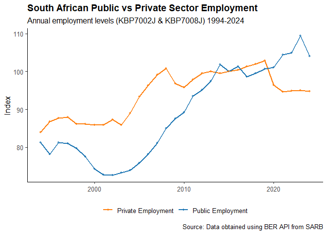
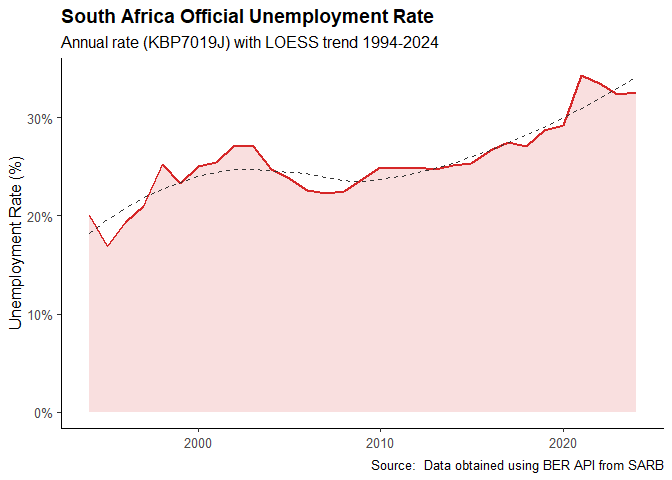

---
output:
  md_document:
    variant: markdown_github
---

# Purpose

The purpose of this tutorial is to implement and practice using Application Programming Interfaces (APIs) to collect pull data and and answer economic questions. This practical is done for the Dynamic Panel section the the module Econometrics 871 at Stellenbosch University.


```r
rm(list = ls()) # Clean your environment:
gc() # garbage collection - It can be useful to call gc after a large object has been removed, as this may prompt R to return memory to the operating system.
```

```
##           used (Mb) gc trigger (Mb) max used (Mb)
## Ncells  531941 28.5    1189630 63.6   660402 35.3
## Vcells 1008270  7.7    8388608 64.0  1769801 13.6
```

```r
library(tidyverse)
```

```
## Warning: package 'tidyverse' was built under R version 4.3.3
```

```
## Warning: package 'ggplot2' was built under R version 4.3.3
```

```
## Warning: package 'tibble' was built under R version 4.3.3
```

```
## Warning: package 'readr' was built under R version 4.3.3
```

```
## Warning: package 'purrr' was built under R version 4.3.3
```

```
## Warning: package 'dplyr' was built under R version 4.3.3
```

```
## Warning: package 'forcats' was built under R version 4.3.3
```

```
## ── Attaching core tidyverse packages ──────────────────────── tidyverse 2.0.0 ──
## ✔ dplyr     1.1.4     ✔ readr     2.1.5
## ✔ forcats   1.0.0     ✔ stringr   1.6.0
## ✔ ggplot2   3.5.0     ✔ tibble    3.2.1
## ✔ lubridate 1.9.5     ✔ tidyr     1.3.2
## ✔ purrr     1.0.2     
## ── Conflicts ────────────────────────────────────────── tidyverse_conflicts() ──
## ✖ dplyr::filter() masks stats::filter()
## ✖ dplyr::lag()    masks stats::lag()
## ℹ Use the conflicted package (<http://conflicted.r-lib.org/>) to force all conflicts to become errors
```

```r
list.files('code/', full.names = T, recursive = T) %>% .[grepl('.R', .)] %>% as.list() %>% walk(~source(.))
```

```
## Skipping install of 'berdata' from a github remote, the SHA1 (db34b39e) has not changed since last install.
##   Use `force = TRUE` to force installation
## ☐ Edit 'C:/Users/tshul/OneDrive/Documents/.Renviron'.
## ☐ Restart R for changes to take effect.
```

```r
# loading libraries required to use the BER API
library(berdata)
library(logger)
library(tidyverse)
library(scales)
```

```
## Warning: package 'scales' was built under R version 4.3.3
```

```
## 
## Attaching package: 'scales'
## 
## The following object is masked from 'package:purrr':
## 
##     discard
## 
## The following object is masked from 'package:readr':
## 
##     col_factor
```

# Data

The data used in this analysis is sourced from the Bureau for Economic Research (BER), a reputable South African research institution that compiles and distributes macroeconomic and labour market indicators. The dataset consists of annual (1994-2024) time-series data for South Africa.

Three key indicators are utilised:

- Public Sector Employment (KBP7002J): Measures total employment within government and public institutions, reflecting the role of the state in labour absorption.

- Private Sector Employment (KBP7008J): Captures total employment in the private sector, serving as an indicator of labour demand driven by business activity and economic conditions.

- Official Unemployment Rate (KBP7019J): Represents the percentage of the labour force that is unemployed according to the official definition, providing a measure of labour market slack.

Together, these indicators allow for an assessment of the structure and dynamics of the South African labour market, particularly the relationship between employment trends and unemployment outcomes.


```r
# Storing the data from the API into a dataframe and removing all NA vaules in the series
employment_data <- get_data(time_series_code = c("KBP7002J", "KBP7008J", "KBP7019J"),
                            output_format = "codes") %>%
  tidyr::drop_na() %>%
  dplyr::rename(
    "Public Employment"    = KBP7002J,
    "Private Employment"   = KBP7008J,
    "Unemployment Rate"    = KBP7019J,
    "Date"=date_col
  )
head(employment_data)
```

```
## # A tibble: 6 × 4
##   Date       `Public Employment` `Private Employment` `Unemployment Rate`
##   <date>                   <dbl>                <dbl>               <dbl>
## 1 1994-01-01                81.3                 83.9                20  
## 2 1995-01-01                78.2                 86.8                16.9
## 3 1996-01-01                81.2                 87.7                19.3
## 4 1997-01-01                81                   88                  21  
## 5 1998-01-01                79.7                 86.1                25.2
## 6 1999-01-01                77.5                 86.1                23.3
```

# Employment Levels: Public vs Private Sector

Both series are expressed as indices, revealing relative trajectories rather than absolute levels. Private employment (orange) started higher and remained relatively stable between roughly 85 and 101 index points from 1994 through the early 2000s, before declining sharply around 2008 to 2009 in line with the global financial crisis. It recovered gradually thereafter but has remained largely flat since around 2015, hovering near the 2007 peak. Public employment (blue), by contrast, was significantly lower than private employment in the 1990s and fell further through the early 2000s, bottoming out around 72 to 73 index points circa 2003. From 2004 onwards it grew strongly and continuously, eventually converging with and then surpassing private employment around 2013 to 2014, peaking near 110 in 2023 before a slight pullback. This divergence, with stagnant private sector employment alongside expanding public sector employment, is a notable structural feature, suggesting that job creation in South Africa has been increasingly driven by the state rather than by private business activity, which has important implications for fiscal sustainability and long-run growth.


```r
employment_long <- employment_data %>%
  tidyr::pivot_longer(
    cols      = c("Public Employment", "Private Employment"),
    names_to  = "Sector",
    values_to = "Employment"
  )

plot1 <- ggplot(employment_long, aes(x = Date, y = Employment, colour = Sector)) +
  geom_line(linewidth = 0.9) +
  geom_point(size = 1.2, alpha = 0.6) +
  scale_y_continuous(labels = scales::comma) +
  scale_colour_manual(values = c("Public Employment"  = "#1f77b4",
                                 "Private Employment" = "#ff7f0e")) +
  labs(
    title    = "South African Public vs Private Sector Employment",
    subtitle = "Annual employment levels (KBP7002J & KBP7008J) 1994-2024 ",
    x        = NULL,
    y        = "Index",
    colour   = NULL,
    caption  = "Source: Data obtained using BER API from SARB"
  ) +
  theme_classic(base_size = 12) +
  theme(
    plot.title      = element_text(face = "bold"),
    legend.position = "bottom",
    panel.grid.minor = element_blank()
  )

print(plot1)
```



# South African unemployment rate using Loess


```r
plot2 <- ggplot(employment_data, aes(x = Date, y = `Unemployment Rate`)) +
  geom_area(fill = "#d62728", alpha = 0.15) +
  geom_line(colour = "#d62728", linewidth = 1) +
  geom_smooth(method = "loess", se = FALSE,
              colour = "#333333", linetype = "dashed", linewidth = 0.7) +
  scale_y_continuous(labels = scales::percent_format(scale = 1),
                     limits = c(0, NA)) +
  labs(
    title    = "South Africa Official Unemployment Rate",
    subtitle = "Annual rate (KBP7019J) with LOESS trend 1994-2024",
    x        = NULL,
    y        = "Unemployment Rate (%)",
    caption  = "Source:  Data obtained using BER API from SARB"
  ) +
  theme_classic(base_size = 12) +
  theme(
    plot.title       = element_text(face = "bold"),
    panel.grid.minor = element_blank()
  )

print(plot2)
```

```
## `geom_smooth()` using formula = 'y ~ x'
```



The unemployment rate shows a broadly upward structural trend over the three decades, as confirmed by the LOESS smoother. Starting near 20% in 1994, it rose sharply through the late 1990s and peaked around 27–28% in the early 2000s, likely reflecting the labour market dislocation that followed the post-apartheid economic transition and trade liberalisation. A modest improvement followed through the 2000s commodity boom, with the rate easing to around 22–23% by the late 2000s. However, the post-2008 global financial crisis reversed this progress, and unemployment climbed steadily again, breaching 30% around 2020 and remaining above 32% through 2024, partly amplified by COVID-19 disruptions. The persistence of high unemployment across all phases of the business cycle points to deep structural constraints, including skills mismatches, rigid labour market institutions, and weak labour absorption capacity in the formal economy.
